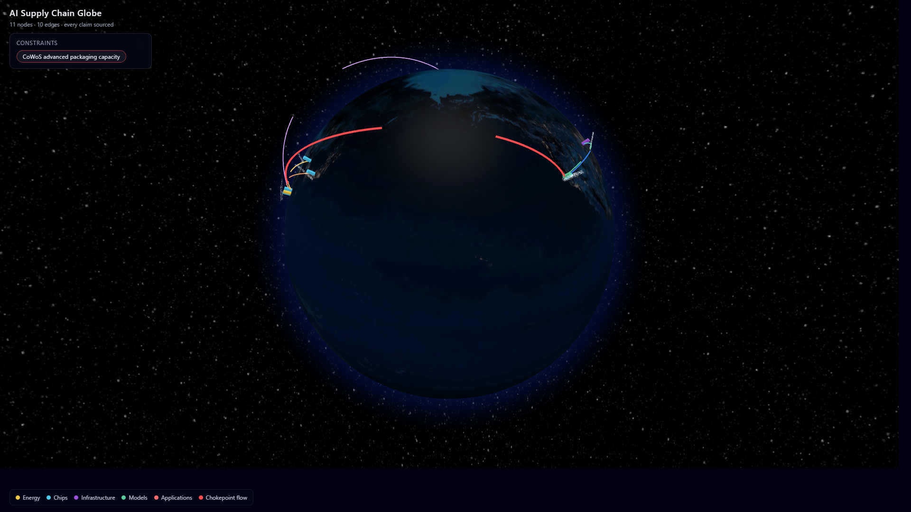
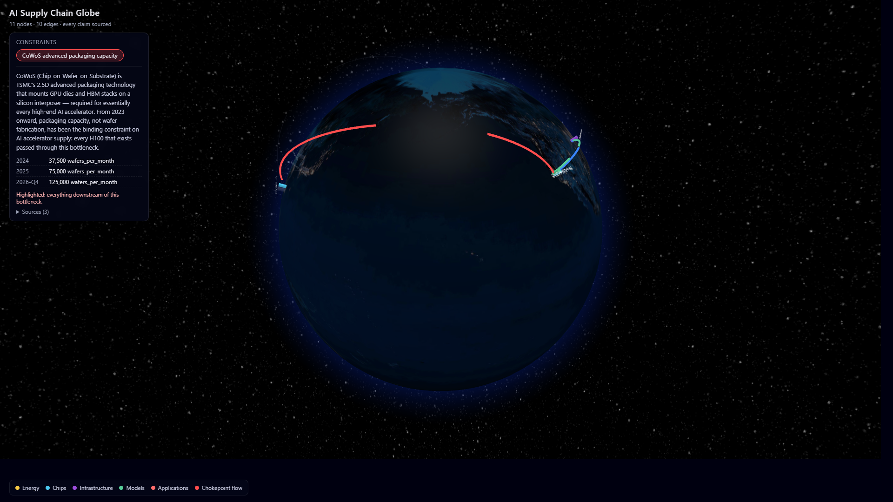
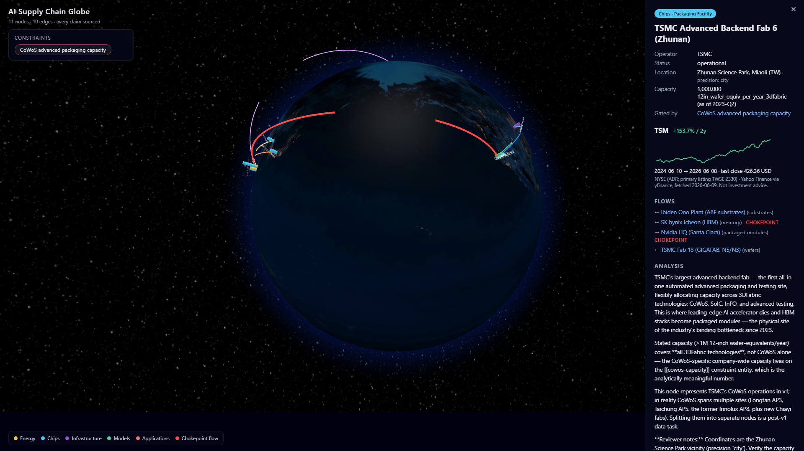

# AI Supply Chain Globe

An interactive 3D globe that maps the global AI supply chain as a directed,
layered graph — from power grids and fabs through advanced packaging, data
centers, model labs, and end-user applications. Every node sits at its real
geographic location; every edge is typed and directional; **every claim
traces to a public, dated source**.



## The 30-second demo

Select the **CoWoS advanced packaging capacity** constraint. Everything
downstream of the bottleneck lights up — packaged accelerators to Nvidia,
GPUs into Azure, training compute to OpenAI, ChatGPT itself — and everything
else dims. The binding constraint on the entire AI buildout, visible as a
graph property, not a slide bullet.



Constraints are first-class, data-driven entities. Today the featured
bottleneck is CoWoS (TrendForce capacity timeline: ~37.5k wafers/month in
2024 → 75k in 2025 → ~125k projected end-2026); when the bottleneck migrates
— HBM, ABF substrates, grid power — new constraint entities tell that story
with zero code changes.

## The five-layer cake

| Layer | v1 nodes |
|---|---|
| **Energy** | Taipower island grid, MidAmerican Iowa (wind → data centers) |
| **Chips** | ASML Veldhoven (EUV), TSMC Fab 18 (N5/N3), TSMC AP6 Zhunan (CoWoS), SK hynix Icheon (HBM), Ibiden Ono (ABF substrates), Nvidia |
| **Infrastructure** | Microsoft Azure West Des Moines — the campus built exclusively to train GPT-4 |
| **Models** | OpenAI |
| **Applications** | ChatGPT |

The v1 scope is deliberately **narrow-deep**: one end-to-end slice, fully
sourced, rather than hundreds of shallow nodes.

## Finance overlay

Public-company nodes carry their ticker and 2-year stock performance —
hover for the badge, click for the sparkline. The supply chain's chokepoints
and the market's verdict on them, on the same map. As of June 2026 the
2-year tape reads like a bottleneck index: SK hynix +918%, Ibiden +482%,
TSMC +154%, ASML +75%, Nvidia +57%, Microsoft −7%.



## Architecture

```
vault/  (Obsidian-compatible markdown + YAML frontmatter — canonical data)
   │
   ▼  scripts/build.py        schema validation: unsourced claims FAIL the build
graph.json
   │                          scripts/fetch_prices.py → prices.json (yfinance)
   ▼  frontend/  (Vite + React + TypeScript + globe.gl)
interactive globe
```

- **Authoring** is plain markdown with structured frontmatter — pleasant in
  Obsidian, but nothing Obsidian-specific is load-bearing.
- **Validation is mechanical:** every node/edge/constraint needs at least
  one dated source; coordinates declare their precision (`site`/`city`/
  `region`); unknown values are `null`, never invented; dangling references
  and layer/type mismatches fail CI on every push.
- **AI-assisted, human-gated:** proposals land in `vault/_pending/` with
  quoted evidence; contested values go through review. Every file carries
  "Reviewer notes" flagging what to double-check.
- **Market data stays out of the vault** — mechanically fetched, provenance
  in `prices.json` meta, never hand-edited.

## Running locally

```sh
pip install -r scripts/requirements.txt
python scripts/build.py            # vault -> frontend/public/graph.json
python scripts/fetch_prices.py     # optional: refresh stock data (committed copy works offline)
cd frontend && npm install && npm run dev
```

Shareable demo states: `?constraint=cowos-capacity`, `?node=tsmc-fab-18`.

## Data methodology

See [`vault/SOURCING.md`](vault/SOURCING.md) for the sourcing standard and
[`schema/`](schema/) for the data model. Capacity figures carry `as_of`
stamps (the future time-slider needs no migration). Where no defensible
public number exists — per-customer CoWoS allocation, campus-level MW —
the field is `null` with a note explaining why. An honest unknown beats a
plausible guess.

Globe textures: NASA-derived imagery via the
[three-globe](https://github.com/vasturiano/three-globe) example assets.
Stock data: Yahoo Finance via yfinance — display only, not investment advice.

## Roadmap

- **Post-v1 constraints (data-only additions):** HBM supply, ABF substrate
  capacity, EUV export controls, Taiwan water/power, US interconnect queues.
- **Time dimension:** every value already carries `as_of`; a slider scrubs
  the buildout (Arizona fabs appearing, CoWoS tripling).
- **Update pipeline:** scheduled source monitoring drafting proposals into
  `_pending/` — always human-reviewed, never auto-merged.
